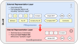

#### [Project Overview](./README.md)
----

# The Dual Layer Language Model (DLLM)

By definition a DSL like Audlang is user-facing. Often DSLs contain *syntactic sugar* ("aggregated features") or even come with special concepts addressing the user's convenience. For example Audlang has a special concept of **[negation](https://github.com/KarlEilebrecht/audlang-spec/blob/main/doc/AudienceDefinitionLanguageSpecification.md#5-negation)** that differentiates between *strict* and *non-strict* behavior.

While syntactic sugar or behavioral extras are convenient for the users of the DSL, they can cause (recurring) headaches to the implementors of components that need to *translate* expressions for *execution*. 

The *Dual Layer Language Model* addresses this issue. Any syntactic sugar or "extra" gets translated into core features of the language *early in the process*.

This is a big advantage for the implementors of [converters](./src/main/java/de/calamanari/adl/cnv/README.md). The set of operators they must consider is significantly smaller than the full language feature set.

Initially, every expression gets parsed into a *[PlExpression](./src/main/java/de/calamanari/adl/erl/PlExpression.java)* on the **[External Representation Layer](./src/main/java/de/calamanari/adl/erl/README.md)**.
 * All features preserved
 * All anomalies preserved (like an OR nested inside another OR)
 * All comments preserved
 * Structure preserved
 * Capability of auto-formatting

This simplifies presentation (formatting) and diagnosis related to Audlang expressions and avoids that users get confused due to premature optimization they did not request or worst case they don't understand.

In a second step (depicted by the bold red arrow above, top-down) the PlExpression gets converted into a *[CoreExpression](./src/main/java/de/calamanari/adl/irl/CoreExpression.java)* on the **[Internal Representation Layer](./src/main/java/de/calamanari/adl/irl/README.md)** (see also [PlToCoreExpressionConverter](./src/main/java/de/calamanari/adl/cnv/PlToCoreExpressionConverter.java)). 
 * Core feature set only (syntactic sugar removed)
 * Comments removed
 * Normalized (anomalies like duplicate members and strange nesting removed)
 * Negation on attribute level, simplified to technical standard (strict)
 * Optimized (if possible)

The resulting expression uses only the core subset of language features without any *syntactic sugar* (elements marked yellow). The implementation in this project additionally applies some *logic optimization* (see also **[CoreExpressionOptimizer](./src/main/java/de/calamanari/adl/irl/biceps/CoreExpressionOptimizer.java)** in package **[irl.biceps](./src/main/java/de/calamanari/adl/irl/biceps/README.md)**) to reduce the complexity of a CoreExpression to a minimum if possible. In contrast to PlExpressions all CoreExpressions are *normalized*, which guarantees a defined order of members (and the removal of duplicates) to make comparison between expressions possible. All comments will be removed, because comments do not contribute to the execution of expressions (see [§1.5 Audlang Spec](https://github.com/KarlEilebrecht/audlang-spec/blob/main/doc/AudienceDefinitionLanguageSpecification.md#15-comments)). CoreExpressions don't carry any comments.

Additionally to the aforementioned differences to PlExpressions you will notice that the concept of negation of CoreExpressions is *strict* compared to PlExpressions where we differentiate between *default* and *strict* negation (see also [§5 Audlang Spec](https://github.com/KarlEilebrecht/audlang-spec/blob/main/doc/AudienceDefinitionLanguageSpecification.md#5-negation)).
In other words: Implementors don't need to worry about the subtle difference between strict and non-strict when creating converters. The `NOT`s you find in CoreExpressions behave exactly as known from most technical expression languages like SQL. Any non-strict negation has been resolved by including `OR IS UNKNOWN` accordingly (see [§3.8 Audlang Spec](https://github.com/KarlEilebrecht/audlang-spec/blob/main/doc/AudienceDefinitionLanguageSpecification.md#38-is-not-unknown)).

All negations (`NOT`) on CoreExpressions *sit directly on the attributes*. CoreExpressions don't support negations on combined expressions. This simplifies the later conversion into target language expressions as not all systems may have a solid concept of negation on combined expressions. You may say: during the conversion of a PlExpression into a CoreExpression *all negations trickle down* to the leafs of the expression tree. 

As you can imagine, the conversion of PlExpressions into CoreExpressions is ***semantically not loss-less*** (at least most of the time). The structure of the expression or the order of members may change, and all comments get lost. Some of these actions cannot be reverted. For example, it is impossible to undo the resolution of a [CURBed Or](https://github.com/KarlEilebrecht/audlang-spec/blob/main/doc/AudienceDefinitionLanguageSpecification.md#43-curbed-or). 

However, CoreExpressions remain compatible to the Audlang Language Specification, so you can anytime parse a CoreExpression or return a CoreExpression (indicated by the double-arrow depicted in the image above). Additionally, there is a **[CoreToPlExpressionConverter](./src/main/java/de/calamanari/adl/cnv/CoreToPlExpressionConverter.java)** that re-creates many higher language features (e.g., `ANY OF`) and brings back the *[default negation](https://github.com/KarlEilebrecht/audlang-spec/blob/main/doc/AudienceDefinitionLanguageSpecification.md#51-default-negation)*.

**Conclusion:** The DLLM decouples the feature-rich end-user-facing DSL of the Audlang from the feature set mandatory to be implemented by any target language converter for expression execution. It would be even be possible to introduce new syntactic sugar to the DSL without disrupting the operation of existing target system adapters.

