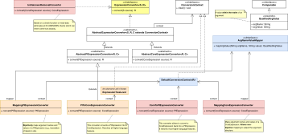
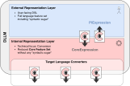

#### [Project Overview](../../../../../../../README.md) | [package adl](../README.md)
----

# package cnv (Conversions)



----

The package **cnv** contains the *foundation code* to convert expressions into a different representation. Based on the provided base classes it is possible to implement a new converter with a few lines of code. Boiler-plate code has been abstracted as far as possible, so that the implementor can concentrate on the details of the target language.



The typical use-case is the implementation of a *target language converter* that translates a given [CoreExpression](../irl/CoreExpression.java) into *anything else* (e.g., an SQL-expression).

:exclamation: **Important:** The project [audlang-java-core](../../../../../../../README.md) does not contain any specific target system converter (e.g., SQL). Here we only provide the foundation to create such converters.


## Class overview

 * **[ExpressionConverter](ExpressionConverter.java)** is the basic converter interface. It is *parameterized* with the *source type **S** to be converted* and the *result type **R***.
 * **[AbstractExpressionConverter](AbstractExpressionConverter.java)** contains the functionality for traversing and converting a recursive tree, still independent from the *source type **S** to be converted* and the *result type **R***. The interface **[ConversionContext](ConversionContext.java)** allows to run a conversion with a custom context. A context object represents the state of the current traversion level. Example: an expression like `color = blue AND (shape = circle OR shape = square)` has obviously two levels (the AND vs. the OR) which must be kept separate. [AbstractExpressionConverter](AbstractExpressionConverter.java) ensures that a concrete implementation always has access to the current level's context and the enclosing parent context object. The details about the context layout (what is stored) is left to a concrete implementation.
 * **[AbstractPlExpressionConverter](AbstractPlExpressionConverter.java)** provides the basis for converting [PlExpressions](../erl/PlExpression.java). The reason for this separation of [PlExpression conversion](../erl/PlExpression.java) and [CoreExpression conversion](../erl/CoreExpression.java) is the different feature to be converted. This involves the two types of visitors [PlExpressionVisitor](../erl/PlExpressionVisitor.java) and [CoreExpressionVisitor](../irl/CoreExpressionVisitor.java).
 * **[AbstractCoreExpressionConverter](AbstractCoreExpressionConverter.java)** is the corresponding base implementation to convert [CoreExpressions](../erl/CoreExpression.java).
 * **[MappingPlExpressionConverter](MappingPlExpressionConverter.java)** and **[MappingCoreExpressionConverter](MappingCoreExpressionConverter.java)** are concrete implementations to translate argument names and values in a given expression. A typical use-case is mapping labels to ids and vice-versa. Although both implementations take an [ArgNameValueMapper](ArgNameValueMapper.java) to perform the mapping, there is an **important difference** between the two. The purpose of **[MappingPlExpressionConverter](MappingPlExpressionConverter.java)** is mapping arguments and values **bijectively** between two worlds which *never leads to structural changes*. 
   ```sql
    color ANY OF (blue, red)
   ```
   could be mapped to:
   ```sql
    var888 ANY OF (128, 132)
   ```
   However, a [MappingPlExpressionConverter](MappingPlExpressionConverter.java) **cannot** map
   ```sql
    color ANY OF (blue, red)
   ```
   to:
   ```sql
    var127 = 1 OR var132 = 1
   ```
   as this means changing the structure of the given [PlExpression](../erl/PlExpression.java). **[MappingCoreExpressionConverter](MappingCoreExpressionConverter.java)** on the other hand does not require the configured [ArgNameValueMapper](ArgNameValueMapper.java) to be bijective or structure-preserving, making the above mentioned mapping-example possible for any [CoreExpressions](../erl/CoreExpression.java).
 * **[PlToCoreExpressionConverter](PlToCoreExpressionConverter.java)** is the standard implementation for converting a [PlExpression conversion](../erl/PlExpression.java) into a [CoreExpression](../irl/CoreExpression.java) after resolving all higher language features.
 * **[CoreToPlExpressionConverter](CoreToPlExpressionConverter.java)** converts a [CoreExpression](../irl/CoreExpression.java) back into a [PlExpression conversion](../erl/PlExpression.java). Some of the higher language features will be re-created. For example, it is impossible to re-create a [Curbed OR](https://github.com/KarlEilebrecht/audlang-spec/blob/main/doc/AudienceDefinitionLanguageSpecification.md#43-curbed-or) from a given CoreExpression.
 * **[ArgNameValueMapper](ArgNameValueMapper.java)** is the interface of components that can translate argument names and argument values *within the realm* of an argument ([QualifiedArgValue](QualifiedArgValue.java)). Besides the [DefaultArgNameValueMapper](DefaultArgNameValueMapper.java) based on a pre-configured [ArgNameValueMapping](ArgNameValueMapping.java) record, there is also a [DummyArgNameValueMapper](DummyArgNameValueMapper.java) to leave argument names and values unchanged.
 * **[IsUnknownRemovalConverter](IsUnknownRemovalConverter.java)**: Based on *configurable meta data* this converter eliminates `IS UNKNOWN`-checks from a [CoreExpression](../irl/CoreExpression.java) if the corresponding attributes cannot be unknown (aka SQL *NOT NULL*). This can simplify a given expression before it gets translated and executed (see also [IsUnknownRemovalConverterTest](../../../../../../test/java/de/calamanari/adl/cnv/IsUnknownRemovalConverterTest.java)).


## Further Reading
 * **[Type Support](./tps/README.md)**: Here you can find a reference implementation of the [Audlang Type Conventions](https://github.com/KarlEilebrecht/audlang-spec/blob/main/doc/AudienceDefinitionLanguageSpecification.md#2-type-conventions).
 * [The Dual Layer Language Model (DLLM)](../../../../../../../TheDualLayerLanguageModel.md)
 * [StandardConversions](../cnv/StandardConversions.java) - Convenient shorthand functions for typical conversion tasks.
 * Unit tests: In the corresponding test package you can find tests related to the classes in this package, e.g., [MappingCoreExpressionConverterTest](../../../../../../test/java/de/calamanari/adl/cnv/MappingCoreExpressionConverterTest.java).


