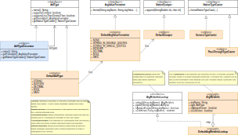

#### [Project Overview](../../../../../../../../README.md) | [package adl](../../README.md) | [package cnv](../README.md)
----

# package tps (Type System)

----

The package **tps** contains a reference implementation of the [Audlang Type Conventions](https://github.com/KarlEilebrecht/audlang-spec/blob/main/doc/AudienceDefinitionLanguageSpecification.md#2-type-conventions). 

When we implement converters to translate a given [CoreExpressions](../erl/CoreExpression.java) into an equivalent expression in a target language (e.g., SQL), we must bridge the gap between the *type-agnostic* Audlang expression and the target system that most likely stores values in typed fields.

Here we provide an extensible type system that covers standard types, value formatting and native casting. 

**Formatting** means bringing a given Audlang argument value (string) into the correct form to be accepted as a correct value within a native expression. For example, a boolean might require translation from `0 -> FALSE` resp. `1 -> TRUE`.

**Casting** addresses a different problem: When you reference a native field within a native expression sometimes a native cast operation is required to make the value compatible to a given parameter value or an other referenced native field. Let's say, you have a reference match (equals) between field A that is string and field B that is integer. In this case you must include any kind of native operation (e.g., `to_int(A)`) to make both fields compatible.

## Class overview

 * **[AdlType](AdlType.java)** is the basic type interface. It is an *interface* to allow adding (or decorating) types because we cannot make final assumptions about all the available types.
 * **[DefaultAdlType](DefaultAdlType.java)** covers the types described in [§2 Type Conventions](https://github.com/KarlEilebrecht/audlang-spec/blob/main/doc/AudienceDefinitionLanguageSpecification.md#2-type-conventions) of the Audience Definition Language Specification. These types and their behavior should be suitable for general purpose requirements.
 * **[AdlTypeDecorator](AdlTypeDecorator.java)** allows introducing a new type by deriving from a given [AdlType](AdlType.java) and its behavior. Typically, this means changing the formatter or the native type caster in some way. Types are unmodifiable, so you get a new instance that usually should have a different name (type identifier).
 * **[ArgValueFormatter](ArgValueFormatter.java)** is the interface to be implemented by classes that can format values in the context of an argument and an operator. The enumeration [DefaultArgValueFormatter](DefaultArgValueFormatter.java) covers the standard formatting, suitable in most cases. :bulb: This implementation applies special handling of date values to make them compatible to numeric target fields.
 * **[NativeEscaper](NativeEscaper.java)** implementations encapsulate the ability to escape certain characters in a target language expression. There is a supplementary class [DefaultEscaper](DefaultEscaper.java) that allows convenient configuration of escape mappings.
 * **[NativeTypeCaster](NativeTypeCaster.java)** is the interface for type casters. As mentioned, sometimes the access to a native field (e.g., a db-column) requires surrounding the field with some native function. The [NativeTypeCaster](NativeTypeCaster.java) knows how to format this piece of expression in a native way. The [PassThroughTypeCaster](PassThroughTypeCaster.java) can only deal with two matching types and throws an exception if the request was made to align different types. The [GenericTypeCaster](GenericTypeCaster.java) assumes a special case where the underlying storage has only a single type (String) but we still want to adjust access to a set of logical types (integer, boolean, date, etc.). With the correct configuration in place the [GenericTypeCaster](GenericTypeCaster.java) maps the field access to all involved native fields. This can be required to correctly support *less than (`<`)* and *greater than (`>`)* (e.g., `'10' < '2'` vs. `2 < 10`.
 * **[ArgMetaInfoLookup](ArgMetaInfoLookup.java)** covers configuration of basic meta data for an argument, including its type and its nature (collection or not, can be unknown or not). The lookup returns an [ArgMetaInfo](ArgMetaInfo.java)-instance for a given argument name. For example the [IsUnknownRemovalConverter](../IsUnknownRemovalConverter.java) can take an [ArgMetaInfoLookup](ArgMetaInfoLookup.java) as its configuration.
 * **[AdlDateUtils](AdlDateUtils.java)** implements the date conventions defined in [§2.3 Audlang Spec](https://github.com/KarlEilebrecht/audlang-spec/blob/main/doc/AudienceDefinitionLanguageSpecification.md#23-date-values) and provides utility methods to correctly add the date to target expressions.

## Further Reading
 * Unit tests: In the corresponding test package you can find tests related to the classes in this package, e.g., [AdlDateUtilsTest](../../../../../../../test/java/de/calamanari/adl/cnv/tps/AdlDateUtilsTest.java), [AdlTypeDecoratorTest](../../../../../../../test/java/de/calamanari/adl/cnv/tps/AdlTypeDecoratorTest.java), [DefaultArgMetaInfoLookupTest](../../../../../../../test/java/de/calamanari/adl/cnv/tps/DefaultArgMetaInfoLookupTest.java) or [GenericTypeCasterTest](../../../../../../../test/java/de/calamanari/adl/cnv/tps/GenericTypeCasterTest.java).

