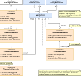

#### [Project Overview](../../../../../../../README.md) | [package adl](../README.md)
----

# package erl (External Representation Layer)



----

The package **erl** (external presentation layer) covers the parsing and reproduction (inline or pretty-print) of Audlang expressions with the full feature set of the Audlang expression.

## Class overview

 * **[PlExpressionBuilder](PlExpressionBuilder.java)** is the concrete ANTLR-parser implementation that can parse an Audlang expression string. The result is an [AudlangParseResult](AudlangParseResult.java).
 * **[AudlangParseResult](AudlangParseResult.java)** either carries a positive or negative parse result. So, even for malformed expressions the caller gets an answer. The calling component may now throw an exception or handle the error in a different way. AudlangParseResults are suitable for JSON-serialization to inform a remote caller about success or the kind of problem with a given expression.
   * If parsing was successful, AudlangParseResult carries a valid [PlExpression](PlExpression.java).
 * **[PlExpression](PlExpression.java)** is the interface every presentation layer expression implements.
   * It was decided to implement the concrete expression types as records and base equals(), hashcode() as well as compareTo() on the string representation. The advantage of this approach is realiability, robustness and speed as no individual code is involved to fulfill the tricky contracts of these methods.In other words: *For any two PlExpressions* **expr1** and **expr2**: `expr2.equals(expr1) := expr2.toString().equals(expr1.toString())`.
 * **[PlMatchExpression](PlMatchExpression.java)** covers all expressions that check the value of an argument (see [§3 Audlang Spec](https://github.com/KarlEilebrecht/audlang-spec/blob/main/doc/AudienceDefinitionLanguageSpecification.md#5-negation)), including UNKNOWN-checks and reference matches. For technical reasons here we also deal with the *intra-negations* (e.g. `color != blue`). The internal class PlMatchExpression.PlMatchOperator contains the full list of the availabe operators and their constraints.
 * **[PlNegationExpression](PlNegationExpression.java)** can *negate* any simple or combined expression, either strict or non-strict (see [§5 Audlang Spec](https://github.com/KarlEilebrecht/audlang-spec/blob/main/doc/AudienceDefinitionLanguageSpecification.md#5-negation))
 * **[PlSpecialSetExpression](PlSpecialSetExpression.java)** covers the two special cases `<ALL>` and `<NONE>` (see [§3.9 Audlang Spec](https://github.com/KarlEilebrecht/audlang-spec/blob/main/doc/AudienceDefinitionLanguageSpecification.md#39-all-and-none))
 * **[PlCombinedExpression](PlCombinedExpression.java)** expresses a logical `AND`- resp. `OR`-combination of two or more expressions (see [§4 Audlang Spec](https://github.com/KarlEilebrecht/audlang-spec/blob/main/doc/AudienceDefinitionLanguageSpecification.md#41-logical-and)).
 * **[PlCurbExpression](PlCurbExpression.java)** surrounds a *curbed OR* (see [§4 Audlang Spec](https://github.com/KarlEilebrecht/audlang-spec/blob/main/doc/AudienceDefinitionLanguageSpecification.md#41-logical-and)).
 * **[PlExpressionVisitor](PlExpressionVisitor.java)** is the specific visitor for PlExpressions. PlExpression is a *parameterized* implementation of AudlangExpression, so the `visit` method accepts this type of visitor.
 * **[PlExpressionDeserializer](PlExpressionDeserializer.java)** is a [Jackson](https://github.com/FasterXML/jackson)-specific implementation of a JSON-deserializer that allows having a generic set of expression members in a JSON list without a special sub-type marker. Instead we *probe* the type by checking for the existence of specific fields. Without this deserializer we could not load simple expressions and combined expressions contained side-by-side in the member list of a combined expression or a curbed OR.

## Formatting

Every successfully parsed expression can be auto-formatted, either *inline* or *pretty-printed* (multiple lines, indented).

**Example 1:**

*Input:*
```sql
(color=blue or engine=Diesel) and brand=Toyota
```

*Parsed:*
```sql
(color = blue OR engine = Diesel) AND brand = Toyota
```

*Parsed (pretty-print):*
```sql
                (
                        color = blue
                     OR engine = Diesel
                    )
                AND brand = Toyota
```

**Example 2:**

*Input:*
```sql
(color=blue /*or engine=Diesel*/) and brand=Toyota
```

*Parsed:*
```sql
color = blue /* or engine=Diesel */ AND brand = Toyota
```

*Parsed (pretty-print):*
```sql
                color = blue
                    /* or engine=Diesel */
                AND brand = Toyota
```

**Example 3:**

*Input:*
```sql
brand=Toyota and ((color any of (red, green, /* violet-metallic, */ yellow,black,grey) and (tech.type contains any of (p9, \"p2\"))) or engine=Diesel) and color=red
```

*Parsed:*
```sql
brand = Toyota AND ( (color ANY OF (red, green, /* violet-metallic, */ yellow, black, grey) AND tech.type CONTAINS ANY OF (p9, p2) ) OR engine = Diesel) AND color = red
```

*Parsed (pretty-print):*
```sql
brand = Toyota
AND (
        (
            color ANY OF (
                red,
                green,
                /* violet-metallic, */
                yellow,
                black,
                grey
            )
        AND tech.type CONTAINS ANY OF (p9, p2)
        )
     OR engine = Diesel
    )
AND color = red
```
:bulb: In the last example you can see that the formatter keeps the original structure except for *unnecessary braces* and *unnecessary quotes*. If possible, comments remain in position.

## Further Reading
 * [StandardConversions](../cnv/StandardConversions.java) - Convenient shorthand functions for typical conversion tasks.
 * Unit tests: In the corresponding test package you can find tests related to the classes in this package, e.g., [PlMatchExpressionTest](../../../../../../test/java/de/calamanari/adl/erl/PlMatchExpressionTest.java). The test [PlStandardSamplesTest](../../../../../../test/java/de/calamanari/adl/erl/PlStandardSamplesTest.java) parses the large set of test examples known from the [Audlang Spec](https://github.com/KarlEilebrecht/audlang-spec/tree/main) project.


