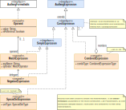

#### [Project Overview](../../../../../../../README.md) | [package adl](../README.md)
----

# package irl (Internal Representation Layer)



----

The package **irl** (internal representation layer) contains the core expressions. Still being compatible to the Audience definition language specification, these expressions have a reduced complexity and provide less features (no *syntactic sugar*, no comments). This makes them better suited for subsequent conversion than external representation layer expressions.

## Class overview

 * **[CoreExpression](CoreExpression.java)** is the interface every internal representation layer expression implements.
   * It was decided to implement the concrete expression types as records and base equals(), hashcode() as well as compareTo() on the string representation of the expression. The advantage of this approach is realiability, robustness and speed as no individual code is involved to fulfill the tricky contracts of these methods. In other words: *For any two CoreExpressions* **expr1** and **expr2**: `expr2.equals(expr1) := expr2.toString().equals(expr1.toString())`.
 * **[SimpleExpression](SimpleExpression.java)**: This interface has been introduced for convenience reasons. It allows to treat matches and negated matches in a common way (e.g., access to the argument name and the values). 
 * **[MatchExpression](MatchExpression.java)** covers a subset of match expressions provided by the Audience Definition Language. The main difference to [PlMatchExpression](../erl/PlMatchExpression.java) (external representation layer) is that any *syntactic sugar* has been *resolved* already (e.g., `argName >= value` resolves to `argName > value OR argName = value`). MatchExpressions either carry a single operand or no operand (the **operand is nullable** for the IS-UNKNOWN-operator). There are no *intra-negations* like `argName != value`. All negations are explicit NegationExpressions.
 * **[NegationExpression](NegationExpression.java)** negates a MatchExpression. In contrast to a [PlNegationExpression](../erl/PlNegationExpression.java) on the external representation layer, a NegationExpression cannot negate any combined expression.
 * **[SpecialSetExpression](SpecialSetExpression.java)** is the equivalent to [PlSpecialSetExpression](../erl/PlSpecialSetExpression.java) on the external representation layer.
 * **[CombinedExpression](CombinedExpression.java)** expresses a logical `AND`- resp. `OR`-combination of two or more core expressions (see [§4 Audlang Spec](https://github.com/KarlEilebrecht/audlang-spec/blob/main/doc/AudienceDefinitionLanguageSpecification.md#41-logical-and)).   
   * By definition, the members of a combined expression must be **unique** and **sorted** (logically a *sorted set*). However, these constraints are a bit tricky and the set type can be difficult to work with, so it was decided to stay with a List instead of a Set. The required assertions (member uniqueness and sort order) are part of the record constructor. :bulb: There are a few static methods (e.g., `andOf(expr1, expr2, ...)`) that conveniently perform constraint checking and automatically return the *best fitting* result expression to the caller.
 * **[CoreExpressionVisitor](CoreExpressionVisitor.java)** is the specific visitor for CoreExpressions. The CoreExpression-interface is a *parameterized* extension of [AudlangExpression](../AudlangExpression.java), so the `visit` method accepts this type of visitor.
 * **[CoreExpressionDeserializer](CoreExpressionDeserializer.java)** is a [Jackson](https://github.com/FasterXML/jackson)-specific implementation of a JSON-deserializer that allows having a generic set of expression members in a JSON list without a special sub-type marker. Instead we *probe* the type by checking for the existence of specific fields. Without this deserializer we could not load simple expressions and combined expressions contained side-by-side in the member list of a combined expression.

## Normalization and Optimization

During the conversion of a *[PlExpression](../erl/PlExpression.java)* into a *[CoreExpression](CoreExpression.java)* there are a couple of *normalization* and *optimization* steps. Simple example: the valid PlExpression `argName = 1 OR argName = 1` would collapse into `argName = 1`. There is a plethora of situations where the resulting expression needs to be adjusted. This kind of mangling is the job of the classes in the package **[irl.biceps](./biceps/README.md)** with the [CoreExpressionOptimizer](./biceps/CoreExpressionOptimizer.java).

## Formatting

Every CoreExpression can be auto-formatted, either *inline* or *pretty-printed* (multiple lines, indented).

**Example 1:**

*Input:*
```sql
(color=blue or engine=Diesel) and brand=Toyota
```

*CoreExpression:*
```sql
brand = Toyota AND (color = blue OR engine = Diesel)
```

*CoreExpression (pretty-print):*
```sql
brand = Toyota
AND (
        color = blue
     OR engine = Diesel
    )
```

:bulb: As you can see the order changed.

**Example 2:**

*Input:*
```sql
(color=blue /*or engine=Diesel*/) and brand=Toyota
```

*CoreExpression:*
```sql
brand = Toyota AND color = blue
```

*CoreExpression (pretty-print):*
```sql
brand = Toyota
AND color = blue
```

:bulb: No comments anymore.

**Example 3:**

*Input:*
```sql
brand = Toyota
AND (
        (
            color ANY OF (
                red,
                green,
                /* violet-metallic, */
                yellow,
                black,
                grey
            )
        AND tech.type CONTAINS ANY OF (p9, p2)
        )
     OR engine = Diesel
    )
AND color = red
```

*CoreExpression:*
```sql
brand = Toyota AND color = red AND (engine = Diesel OR tech.type CONTAINS p2 OR tech.type CONTAINS p9)
```

*CoreExpression (pretty-print):*
```sql
brand = Toyota
AND color = red
AND (
        engine = Diesel
     OR tech.type CONTAINS p2
     OR tech.type CONTAINS p9
    )
```

:bulb: Comments and any higher language features resolved, logical redundancies removed.

## Further Reading
 * [StandardConversions](../cnv/StandardConversions.java) - Convenient shorthand functions for typical conversion tasks.
 * [Binary Core Expression Processing System](./biceps/README.md) - Normalization and optimization of core expressions.
 * Unit tests: In the corresponding test package you can find tests related to the classes in this package, e.g., [MatchExpressionTest](../../../../../../test/java/de/calamanari/adl/irl/MatchExpressionTest.java). [ResolvedCurbExpressionTest](../../../../../../test/java/de/calamanari/adl/irl/ResolvedCurbExpressionTest.java) demonstrates the resolution of curbed ORs.


