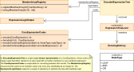

#### [Project Overview](../../../../../../../../README.md) | [package adl](../../README.md) | [package irl](../README.md)
----

# package biceps (Binary Core Expression Processing System)



----

The classes in this package deal with normalization and optimization of [CoreExpressions](../CoreExpression.java).

Especially, optimization by applying boolean logic to a complex nested expression involves rebuilding the expression - potentially several times. Although [CoreExpressions](../CoreExpression.java) are rather thin records, tests have shown that it is not a good idea to implement such kind of *mangling* directly on CoreExpressions. Not only that the performance  suffers, also the memory consumption is high due to tons of the temporary objects.

Thus it was decided to implement a solution that avoids objects but stores every expression as a binary value (32-bit integer). So, every simple expression (match or negated match) is an **int**, and every combined expression is also an **int**. In the first case the **int** is the encoded MatchExpression (for quickly determining its properties), and for CombinedExpressions the **int** encodes the type (AND vs. OR) plus a reference to the members-**int-array**. Starting with a single **int** (root) we can read the whole expression recursively by decoding the nodes. This also allows fast navigation and rebuild. Comparisons and certain options can be performed very quickly on binary level. For example, a negation (otherwise a matter of creating a [NegationExpression](../NegationExpression.java) surrounding a [MatchExpression](../MatchExpression.java)) resp. the removal) can be performed by switching a single bit. Of course this is by magnitudes faster!

Once the optimization is complete we simply convert the binary encoded expression back to a CoreExpression.

## Class overview

 * **[CoreExpressionCodec](CoreExpressionCodec.java)** is responsible for encoding simple expressions or an ID that references the members of [CombinedExpressions](../CombinedExpression.java). It uses the 32-bits of an integer to encode the characteristics of an expression. Internally, the codec keeps a dictionary with all the argument names and values for eventually re-creating a [CoreExpression](../CoreExpression.java).
 * **[MemberArrayRegistry](MemberArrayRegistry.java)** keeps track of member-arrays. These are the lists of encoded member expressions inside an encoded [CombinedExpressions](../CombinedExpression.java). The registry assigns a unique **int**-id to each unique member array and ensures that such an array exists only once. The benefit of this approach is that we can later compare (equals) encoded expressions by simply comparing the **int**-value. The downside of the solution is of course that we sacrifice automatic garbage collection because the system does not know anymore when a member array is no longer in use. As long as it sits in the registry the object is alive. Thus, the [MemberArrayRegistry](MemberArrayRegistry.java) has a housekeeping function that allows triggering a cleanup in safe moments to avoid excessive memory consumption.
 * **[EncodedExpressionTree](EncodedExpressionTree.java)** is the central class for working with the expression tree. As explained the *tree* does not consist of objects, thus the EncodedExpressionTree is only the maintainer of the root **int** plus a comprehensive set of features to modify/create nodes and their child-nodes.
 * **[ExpressionTreeLevel](ExpressionTreeLevel.java)** is just a record with a [GrowingIntArray](GrowingIntArray.java) that allows collecting encoded CoreExpressions while building an expression bottom-up. The purpose of multiple independent temporary levels is the support of the [CoreExpressionBuilder](../../cnv/PlToCoreExpressionConverter.java) to convert a [PlExpression](../../erl/PlExpression.java) step by step into a CoreExpression.
 * **[ExpressionLogicHelper](ExpressionLogicHelper.java)** contains the boolean logic for dealing with complex expressions. It works directly on the binary nodes of an [EncodedExpressionTree](EncodedExpressionTree.java).
 * **[MemberUtils](MemberUtils.java)**: Utilities for accessing the members of a combined expression as well as preparing member lists (e.g., filter, merge).
 * **[CoreExpressionOptimizer](CoreExpressionOptimizer.java)** performs a series of steps on an [EncodedExpressionTree](EncodedExpressionTree.java) to normalize and optimize an expression. Optimization can fail if the given expression is overly complex. The process can run into a combinatoric explosion that takes very long and eventually blows up the memory. To avoid this, the optimizer has a built-in [TimeOut](../../TimeOut.java) that aborts the attempt if it cannot be completed within a certain time. If an expression runs in a combinatoric explosion during optimization then it is very unlikely that an underlying target platform would be able to execute the expression. The default timeout is 5 seconds.
 * **[ImplicationResolver](ImplicationResolver.java)** is a collection of rule-based transformations to detect redundancies and contradictions in a nested expression. It is used during the optimization.
 * **[OrOfAndNormalizer](OrOfAndNormalizer.java)**: This normalizer creates the *base line* to start re-creating and optimizing an expression by transforming it into a single *OR* of *ANDs*. **Example:**
   ```sql
                color = blue
                AND (
                        engine = Diesel
                     OR engine = gas
                     OR (
                            engine = alternative
                        AND fuel = hydrogen
                        )
                    )
   ```
   turns into:
   ```sql
   (
          color = blue 
      AND engine = Diesel
      )
   OR (
          color = blue 
      AND engine = gas
      ) 
   OR (
          color = blue 
      AND engine = alternative 
      AND fuel = hydrogen
      )
   ```
 * **[OrOfAndOverlapRegrouper](OrOfAndOverlapRegrouper.java)** is the counterpart of the [OrOfAndNormalizer](OrOfAndNormalizer.java) as it does the opposite. This component changes the structure to a more nested form to shorten the expression. **Example:**
    ```sql
   (
          color = blue 
      AND engine = Diesel
      )
   OR (
          color = blue 
      AND engine = gas
      ) 
   OR (
          color = blue 
      AND engine = alternative 
      AND fuel = hydrogen
      )
   ```
   turns into:
   ```sql
                color = blue
                AND (
                        engine = Diesel
                     OR engine = gas
                     OR (
                            engine = alternative
                        AND fuel = hydrogen
                        )
                    )
   ```
   While the *OR-of-ANDs*-form has a couple of advantages for detecting implications, this format is rather verbose (repetitive). Thus, we apply the [OrOfAndOverlapRegrouper](OrOfAndOverlapRegrouper.java) towards the end of the optimization process.
 * **[ExpressionTreeSimulator](ExpressionTreeSimulator.java)** is meant for testing and analysis purposes only. It applies a *brute-force* approach to compute a [truth-table](https://en.wikipedia.org/wiki/Truth_table) report for a given expression or two expressions side-by-side (see [ExpressionTreeSimulatorTest](../../../../../../../test/java/de/calamanari/adl/irl/biceps/ExpressionTreeSimulatorTest.java)). This can be helpful if you are unsure if an optimized version of an expression still reflects the logically same expression. **Example:**
   ```sql
   color = blue and engine any of (Diesel, Electric)
   ```
   *returns:*
   ```
   Simulated expression E1: color = blue AND (engine = Diesel OR engine = Electric)

   Conditions:

    0 : color = blue
    1 : engine = Diesel
    2 : engine = Electric

     0  1  2    E1   
    -----------------
     0  0  0 | FALSE  
     0  0  1 | FALSE
     0  1  0 | FALSE
     0  1  1 | FALSE
     1  0  0 | FALSE
     1  0  1 | TRUE
     1  1  0 | TRUE
     1  1  1 | TRUE   

   ```
   :exclamation: Due to the **brute-force-approach** the simulator can quickly run into a *combinatoric explosion*. For example, if there are 16 conditions (each can be true or false), then there are $2^{16}$ entries in the truth table. If the number of conditions grows against 32 the experiment *must fail!*

## Further Reading

 * [CoreExpressionCodecTest](../../../../../../../test/java/de/calamanari/adl/irl/biceps/CoreExpressionCodecTest.java)
 * [ExpressionTreeSimulatorTest](../../../../../../../test/java/de/calamanari/adl/irl/biceps/ExpressionTreeSimulatorTest.java)
 * [CombinedExpressionTest](../../../../../../../test/java/de/calamanari/adl/irl/CombinedExpressionTest.java) contains a couple of examples which involve optimization.


